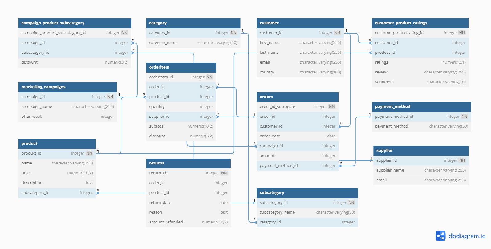

# OLTP Business Data Research

> [!NOTE]
> Back to the navigation map: [Document Navigation Map](../../README.md)

### Data Source

Data source is available: [https://www.kaggle.com/datasets/mkechinov/ecommerce-behavior-data-from-multi-category-store/data](https://www.kaggle.com/datasets/mkechinov/ecommerce-behavior-data-from-multi-category-store/data)

### Entity-Relationship (ER)

    

### OLTP Tables

| **Table**              | **Description**                                                                                                                       | **Fact  Table/ Dimension Table** | **Increment Load/ Full Load** | **DWH Sync frequency** | **Partitioned By** |
| ---------------------------- | ------------------------------------------------------------------------------------------------------------------------------------------- | -------------------------------------- | ----------------------------------- | ---------------------------- | ------------------------ |
| orders                       | A fact table to record the orders by the customer                                                                                           | Fact                                   | Increment Load                      | daily                        | Date                     |
| ordersitem                   | A fact table to record detailed info for the order, including quantity, supplier, subtotal, discount info for each product under the order. | Fact                                   | Increment Load                      | daily                        | Date                     |
| returns                      | A fact table to record the returned orders                                                                                                  | Fact                                   | Increment Load                      | daily                        | Date                     |
| customer_product_ratings     | A fact table to record the ratings given from the customer to each product                                                                  | Fact                                   | Increment Load                      | daily                        | Date                     |
| category                     | A dimension table to product category                                                                                                       | Dimension                              | Full Load                           | daily                        | Date                     |
| subcategory                  | A dimension table to subcategorize the product based on existing category                                                                   | Dimension                              | Full Load                           | daily                        | Date                     |
| supplier                     | A dimension table to record the supplier information, including name and email                                                              | Dimension                              | Full Load                           | daily                        | Date                     |
| product                      | A dimension table to record the product information, including name, price, description of products, and subcategory id.                    | Dimension                              | Full Load                           | daily                        | Date                     |
| payment_method               | A dimension table to record the payment method                                                                                              | Dimension                              | Full Load                           | daily                        | Date                     |
| campaign_product_subcategory | A dimension table to record the discount for each subcategory under the certain campaign.                                                   | Dimension                              | Full Load                           | daily                        | Date                     |
| marketing_campaigns          | A dimension table to record the campaign name and the ordinal week of a year                                                                | Dimension                              | Full Load                           | daily                        | Date                     |
| customer                     | A dimension table to record the customer information including name, email, country                                                         | Dimension                              | Full Load                           |                              |                          |

## Data Dictionary

| **Table**              | **Columns**               | **Description**                                            | **Data Type** | **Primary Key** | **Foreign Key to Table** | **NULLable** |
| ---------------------------- | ------------------------------- | ---------------------------------------------------------------- | ------------------- | --------------------- | ------------------------------ | ------------------ |
| campaign_product_subcategory | campaign_product_subcategory_id | unique id for each row in table `campaign_product_subcategory` | integer             | YES                   |                                | NO                 |
| campaign_product_subcategory | campaign_id                     | campaign id (16 in total)                                        | integer             |                       | marketing_campaigns            | YES                |
| campaign_product_subcategory | subcategory_id                  | subcategory id (100 in total)                                    | integer             |                       | subcategory                    | YES                |
| campaign_product_subcategory | discount                        | discount number (from 0 to 1)                                    | numeric(3,2)        |                       |                                | YES                |
| category                     | category_id                     | unique identifier for table `category`                         | integer             | YES                   |                                | NO                 |
| category                     | category_name                   | name of category, like Clothing, Books, Grocery…                | character           |                       |                                | YES                |
| customer                     | customer_id                     | unique id for each row in table `customer`                     | integer             | YES                   |                                | NO                 |
| customer                     | first_name                      | First name for the customer                                      | character           |                       |                                | YES                |
| customer                     | last_name                       | Last name for the customer                                       | character           |                       |                                | YES                |
| customer                     | email                           | The email address for the customer                               | character           |                       |                                | YES                |
| customer                     | country                         | The country that the customer is from                            | character           |                       |                                | YES                |
| customer_product_ratings     | customerproductrating_id        | unique id for each row in table `customer_product_ratings`     | integer             | YES                   |                                | NO                 |
| customer_product_ratings     | customer_id                     | The customer gave the review and ratings.                        | integer             |                       | customer                       | YES                |
| customer_product_ratings     | product_id                      | The product that was given the review and ratings.               | integer             |                       | product                        | YES                |
| customer_product_ratings     | ratings                         | The ratings specific number                                      | numeric(2,1)        |                       |                                | YES                |
| customer_product_ratings     | review                          | The review text                                                  | character           |                       |                                | YES                |
| customer_product_ratings     | sentiment                       | The final sentiment (”good” or “bad”)                        | character           |                       |                                | YES                |
| marketing_campaigns          | campaign_id                     | unique id for each row in table marketing_campaigns              | integer             | YES                   |                                | NO                 |
| marketing_campaigns          | campaign_name                   | The campaign name                                                | character(255)      |                       |                                | YES                |
| marketing_campaigns          | offer_week                      | Represents the ordinal of a year                                 | integer             |                       |                                | YES                |
| orderitem                    | orderitem_id                    | unique id for each row in table `orderitem_id`                 | integer             | YES                   |                                | NO                 |
| orderitem                    | order_id                        | to find the order in table `orders`                            | integer             |                       | orders                         | YES                |
| orderitem                    | product_id                      | to find the product in the table `products`                    | integer             |                       | products                       | YES                |
| orderitem                    | quantity                        | the quantity of each product under this order                    | integer             |                       |                                | YES                |
| orderitem                    | supplier_id                     | to find the supplier in the table `supplier`                   | integer             |                       | supplier                       | YES                |
| orderitem                    | subtotal                        | the subtotal amount for this order (quantity times price)        | numeric(10,2)       |                       |                                | YES                |
| orderitem                    | discount                        | the discount for this order                                      | numeric(5,2)        |                       |                                | YES                |
| orders                       | order_id_surrogate              | unique id for each row in table `orders`                       | integer             | YES                   |                                | NO                 |
| orders                       | order_id                        | id for orders, could be duplicated                               | integer             |                       |                                | YES                |
| orders                       | customer_id                     | The customer associated with the order                           | integer             |                       | customer                       | YES                |
| orders                       | order_date                      | The date generated on the order                                  | date                |                       |                                | YES                |
| orders                       | campaign_id                     | The campaign associated with the order                           | integer             |                       | marketing_campaigns            | YES                |
| orders                       | amount                          | The amount in this order associated with the order               | integer             |                       |                                | YES                |
| orders                       | payment_method_id               | The Payment Method for this order                                | integer             |                       | payment_method                 | YES                |
| payment_method               | payment_method_id               | unique id for `payment_method`                                 | integer             | YES                   |                                | NO                 |
| payment_method               | payment_method                  | payment method name                                              | character           |                       |                                | YES                |
| product                      | product_id                      | unique id for each row in table `product`                      | integer             | YES                   |                                | NO                 |
| product                      | name                            | name for product                                                 | character           |                       |                                | YES                |
| product                      | price                           | price for product, decimal with 2 places                         | numeric(10,2)       |                       |                                | YES                |
| product                      | description                     | product description                                              | text                |                       |                                | YES                |
| product                      | subcategory_id                  | foreign key to `subcategory`                                   | integer             |                       | subcategory                    | YES                |
| returns                      | return_id                       | unique id for each row in table `returns`                      | integer             | YES                   |                                | NO                 |
| returns                      | order_id                        | The order associated with the returned order                     | integer             |                       | order                          | YES                |
| returns                      | product_id                      | The product associated with the returned order                   | integer             |                       | product                        | YES                |
| returns                      | return_date                     | The returned date for this order                                 | date                |                       |                                | YES                |
| returns                      | reason                          | The reason why customer returned this order.                     | text                |                       |                                | YES                |
| returns                      | amount_refunded                 | The amount refund to the customer                                | numeric(10,2)       |                       |                                | YES                |
| subcategory                  | subcategory_id                  | unique id for `subcategory`                                    | integer             | YES                   |                                | NO                 |
| subcategory                  | subcategory_name                | subcategory name                                                 | character(50)       |                       |                                | NO                 |
| subcategory                  | category_id                     | link to table `category`                                       | integer             |                       | category                       | NO                 |
| supplier                     | supplier_id                     | unique id for `supplier`                                       | integer             | YES                   |                                | NO                 |
| supplier                     | supplier_name                   | name for supplier                                                | character           |                       |                                | YES                |
| supplier                     | email                           | email for supplier                                               | character           |                       |                                | YES                |

Some basic business logic conclusion after reviewing the data and making this dictionary:

- Literally only three business behavior by customer: buy, return and rate, corresponding to `Returns`, `Orders`, `OrderItem`, `customer_product_ratings`
- `OrderItem` is the much detailed for table `Order`，**Granularity: Product**
- Every return request for the order is going to return everything under the order
