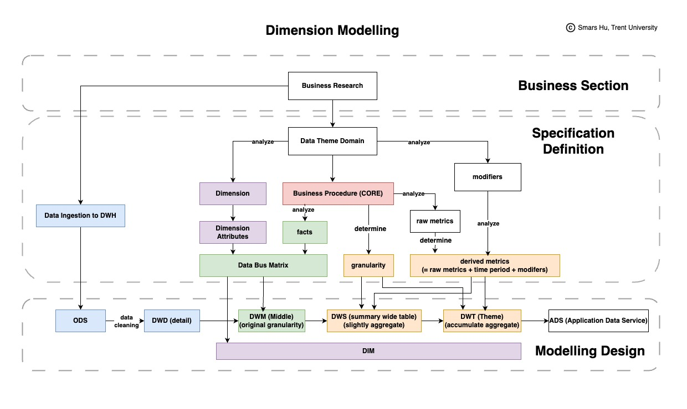

# Standardized Process for Data Warehouse Modeling (SOP)

> [!NOTE]
> Back to the navigation map: [Document Navigation Map](../README.md)

## **Summary**

- ✅ Business Database Research
- ✅ Data Ingestion
- ✅ Business Domain Segmentation
- ✅ Dimensional Modeling Design (Bus Matrix + Defining Metrics)
- ✅ Design Review
- ✅ Code Development

    

## **Roadmap**

### **1. Business Database Research**

> The primary objective of business database research is to investigate the **business logic and table structures** of the source system.
> If the system is large, it can be analyzed **module by module** to gradually refine the understanding.

**Deliverables:**

- Identification of key stakeholders: **Product Owner → Development Leader → Module Owners**
- Collection of relevant documentation:
  - **System product design**
  - **Business process design**
  - **Data flow relationships between systems**
  - ...
- **Complete ER model / Tables Structure** in the source system
- **Table description**
- **Data dictionary**

### **2. Data Ingestion**

> This phase involves designing the **data ingestion logic** for the **Operational Data Store (ODS)** based on the findings from the database research.

**Deliverables:**

- **List of tables** to be ingested into the data warehouse
  - In principle, all **business-relevant and actively used tables** should be included.
- **Design of ingestion rules:**
  - **Fact Table** is typically ingested **incrementally** (binlog-based ingestion).
  - **Dimension Table** is typically ingested **in full**.
- **Data exploration and validation:**
  - Ensure **enumeration values** are complete.
  - Check for **null values** in key fields.
  - ...

### **3. Business Domain Segmentation**

> Segment business domains based on business processes, ensuring logical organization for analytical use cases.

### **4. Dimensional Modeling Design**

> Build the data model following the dimensional modeling methodology.

    

**Steps:**

- **Identify the core business processes** that the data warehouse needs to support.
- **Construct the Bus Matrix (DIM, DWM):**
  - **Identify Shared Dimensions**
  - **Identify the Facts**
  - **Build the Bus Matrix** – A tabular representation of the relationships between **business processes (fact tables)** and **shared dimensions**.
- **Design aggregated tables (DWS, DWT):**
  - **Determine Granularity** – Predict the required level of detail for all analytical needs and define the appropriate grain.
  - **Define key business metrics**, including both **raw** and **derived metrics**.

### **5. Design Review**

> After completing the design phase, conduct a **review session** to align the **data warehouse team’s understanding of the business** and reinforce best practices in modeling.

**Review Checklist:**

- **Are domain segmentation and data layering reasonable?**
- **Is the table structure compliant with data warehouse standards?**
- **Is the data model properly designed?**
  - Are there **missing dimensions**?
  - Can additional **metrics or identifiers** be extracted?
- **Are the table update rules properly defined?**

### **6. Code Development**

> Proceed with **ETL development** based on the finalized dimensional model and ingestion design.
