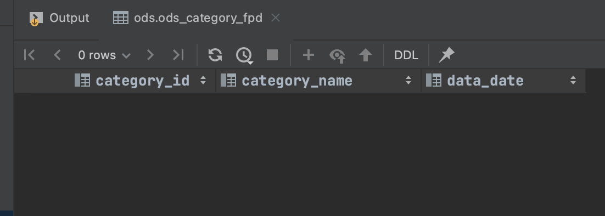
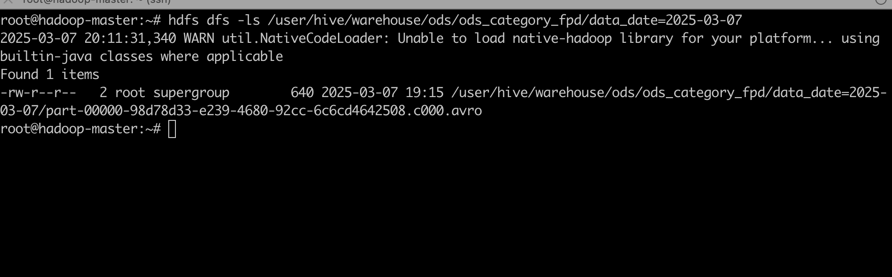
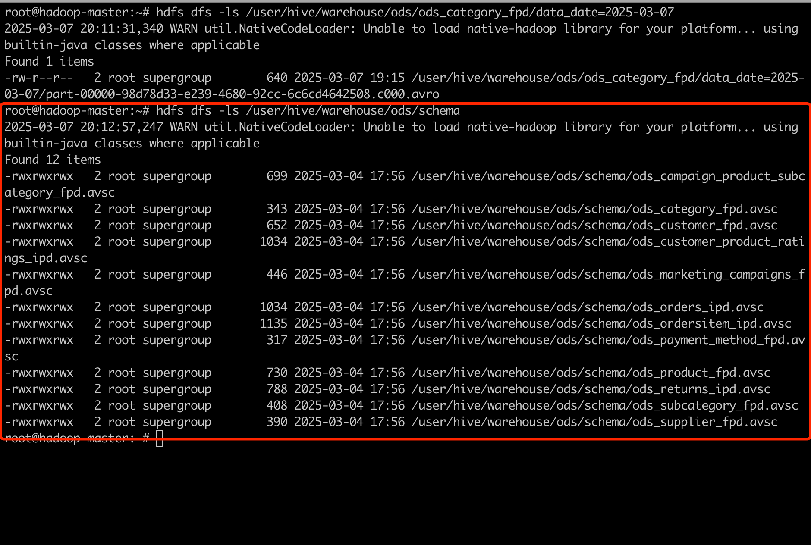
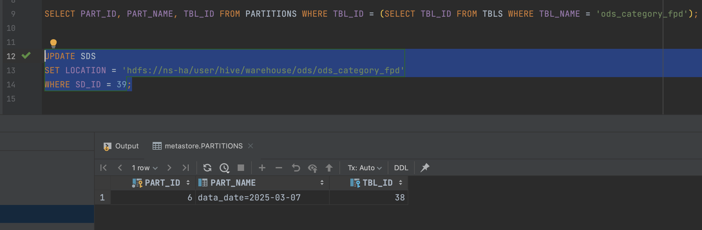
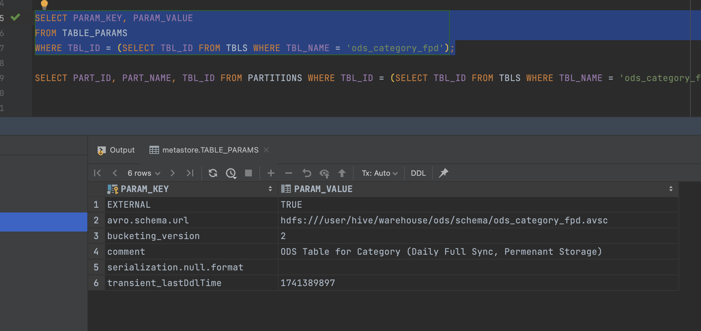
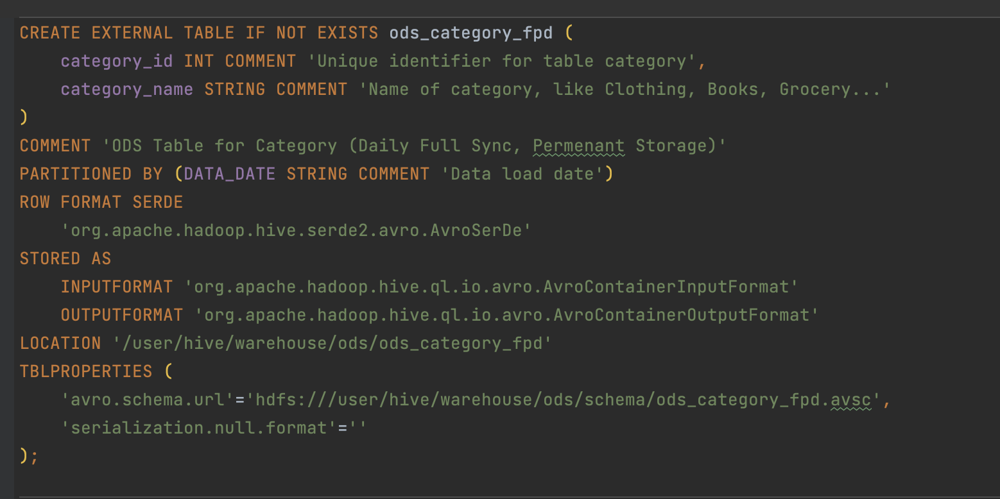
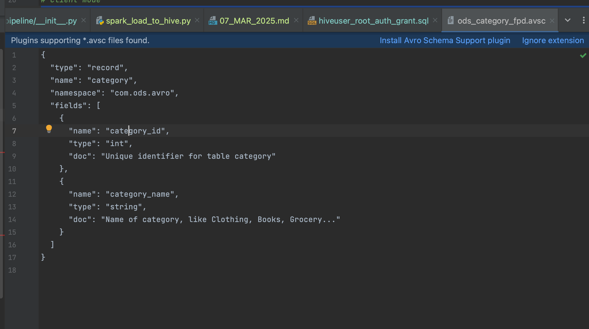
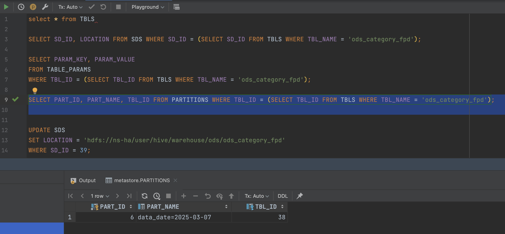
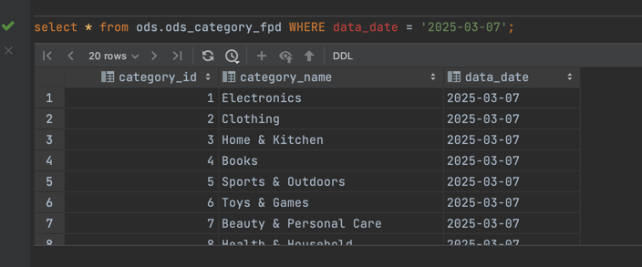

# **Spark Task - Issue with Writing ODS Layer Avro Data to HDFS but Hive Cannot Read**

## **Background**

In this task, the Spark job extracts data from an **Oracle database** and writes it to **HDFS**, with the goal of querying it from the **Hive ODS layer**.
The objective is to store the data in **Avro format** while ensuring that Hive can successfully read it.

This troubleshooting process is divided into **two phases**:

1. **Directly querying the Hive table returned no data** (Hive seemed unable to read the Avro file from HDFS)



2. **Directly querying Hive resulted in a schema mismatch error** (Hive could read the Avro file but failed to parse the schema)

```plaintext
java.io.IOException: org.apache.avro.AvroTypeException: Found topLevelRecord, expecting com.ods.avro.category, missing required field category_id
```

## **Troubleshooting Approach**

The issue of not being able to retrieve data is just a symptom. The possible root causes include:

1. **Spark retrieved an empty DataFrame**

   - Did Oracle return an empty result set?
   - Did the SQL query apply a filter that excluded all data?
2. **Spark successfully wrote data, but there is an issue with the files in HDFS**

   - Are there Avro files in HDFS?
   - Is an unsupported Avro compression format being used?
   - Did Spark encounter an error during the `.write` operation without reporting it?
3. **Hive table definition issues**

   - Is the `LOCATION` path correct?
   - Is the `TBLPROPERTIES` configuration (`avro.schema.url`) pointing to the correct schema?
   - Was the partition column defined correctly?
4. **Avro schema file (`.avsc`) issues**

   - Does the `name` in the Avro schema need to match the Hive table name?
   - Does Hive fail to recognize the schema because of a missing `namespace`?
5. **Hive Metastore (MySQL) has not been updated**

   - Was the partition properly created in the Metastore, or is it missing?
   - Did `MSCK REPAIR TABLE` successfully add missing partitions?

## **Troubleshooting Process & Solutions**

### **Issue 1: Hive Query Returns No Data**

#### **Analysis**

Executing:

```sql
SELECT * FROM ods.ods_category_fpd;
```

Returns **zero rows**, which means **Hive is not detecting the Avro file in HDFS**.

#### **Steps to Investigate**

1. **Check if Avro files exist in HDFS**

   ```bash
   hdfs dfs -ls /user/hive/warehouse/ods/ods_category_fpd/DATA_DATE=2025-03-07
   ```


   **Verification: Avro files are present in HDFS**:

   ```
   -rw-r--r--   2 root supergroup        999 2025-03-07 18:31 /user/hive/warehouse/ods/ods_category_fpd/DATA_DATE=2025-03-07/part-00000.avro
   ```


   **Conclusion: Spark successfully wrote data to HDFS.**

2. **Check if Hive Metastore contains partition metadata**

   ```sql
   SELECT PART_ID, PART_NAME, TBL_ID FROM PARTITIONS 
   WHERE TBL_ID = (SELECT TBL_ID FROM TBLS WHERE TBL_NAME = 'ods_category_fpd');
   ```

   **Observation: No partition records in the Metastore.**This confirms that **Hive did not register the `DATA_DATE=2025-03-07` partition**, preventing it from detecting the data.
3. **Attempt to repair partitions**

   ```sql
   MSCK REPAIR TABLE ods.ods_category_fpd;
   ```

   However, this command did not resolve the issue as the partition remained missing.
4. **Manually add the partition**

   ```sql
   ALTER TABLE ods_category_fpd 
   ADD PARTITION (DATA_DATE='2025-03-07') 
   LOCATION 'hdfs://ns-ha/user/hive/warehouse/ods/ods_category_fpd/DATA_DATE=2025-03-07';
   ```

   **Verification: The partition is now registered in the Metastore.**

   ```sql
   SELECT * FROM PARTITIONS WHERE TBL_ID = (SELECT TBL_ID FROM TBLS WHERE TBL_NAME='ods_category_fpd');
   ```

   **Problem resolved: Hive can now recognize the Avro file in HDFS.**

### **Issue 2: Hive Query Fails Due to Schema Mismatch**

#### **Error Message**

```plaintext
java.io.IOException: org.apache.avro.AvroTypeException: Found topLevelRecord, expecting com.ods.avro.category, missing required field category_id
```

#### **Steps to Investigate**

1. **Check the Avro schema used in Hive table definition**

   ```sql
   SELECT PARAM_KEY, PARAM_VALUE FROM TABLE_PARAMS 
   WHERE TBL_ID = (SELECT TBL_ID FROM TBLS WHERE TBL_NAME='ods_category_fpd');
   ```

    

   **Verification: `avro.schema.url = 'hdfs:///user/hive/warehouse/ods/schema/ods_category_fpd.avsc'`**.

   

2. **Check the `.avsc` schema file**

   ```json
   {
     "type": "record",
     "name": "category",
     "namespace": "com.ods.avro",
     "fields": [
       {"name": "category_id", "type": "int"},
       {"name": "category_name", "type": "string"}
     ]
   }
   ```
    

   However, **Spark wrote an Avro file where the embedded schema name was `topLevelRecord` instead of `category`**, leading to a mismatch.
   based on [https://spark.apache.org/docs/3.5.1/sql-data-sources-avro.html]

3. **Verify Spark’s Avro schema when writing**
   By default, Spark `.write.format("avro")` does not retain the schema name and namespace, instead setting it to `topLevelRecord`.
4. **Fix the Spark Avro write schema**

   ```python

    hive_hdfs_table_path = "/user/hive/warehouse/ods/ods_category_fpd"
    save_mode = "overwrite"
    hive_format = "avro"
    avro_schema_json = """
    {
    "type": "record",
    "name": "category",
    "namespace": "com.ods.avro",
    "fields": [
        {
        "name": "category_id",
        "type": "int",
        "doc": "Unique identifier for table category"
        },
        {
        "name": "category_name",
        "type": "string",
        "doc": "Name of category, like Clothing, Books, Grocery..."
        }
    ]
    }
    """
    # load
    try:
        df = df.withColumn("DATA_DATE", date_format(current_date(), "yyyy-MM-dd"))
        df = df.withColumnRenamed("CATEGORY_ID", "category_id") \
            .withColumnRenamed("CATEGORY_NAME", "category_name")
        df = df.withColumn("category_id", col("category_id").cast(IntegerType()))
        df = df.withColumn("category_name", col("category_name").cast(StringType()))
        df = df.withColumn("data_date", date_format(current_date(), "yyyy-MM-dd"))

        (
            df.write
            .format(hive_format)  # "avro"
            .mode(save_mode)  # "overwrite"
            .option("avroSchema", avro_schema_json)
            .option("compression", "uncompressed") # do not use Snappy
            .partitionBy("data_date")
            .save(hive_hdfs_table_path)
        )

        print(f"Successfully saved DataFrame ({save_mode}) to HDFS path '{hive_hdfs_table_path}' in {hive_format} format.")
    except Exception as e:
        print(f"Failed to save DataFrame to HDFS path '{hive_hdfs_table_path}': {e}")
    
   ```

## **Root Cause Summary**

1. **Hive Query Returns No Data**

   - The **MySQL Metastore did not contain the partition record**, preventing Hive from detecting the Avro file in HDFS.
   - Solution: **Manually add the partition** or **run `MSCK REPAIR TABLE`**.

   
2. **Schema Mismatch**

   - **Spark wrote Avro files with an embedded schema named `topLevelRecord`**, while Hive expected `category` with `namespace=com.ods.avro`.
   - Solution: 
     - **Explicitly specify Avro schema in Spark `.write` operation** using `.option("avroSchema", avro_schema_json)`.
     - convert the data type before write using `df.withColumn("category_id", col("category_id").cast(IntegerType()))` etc

## **Final Solutions**

1. **Fix Hive Metastore Partition Issue**
   ```sql
   ALTER TABLE ods_category_fpd ADD PARTITION (DATA_DATE='2025-03-07');
   ```
2. **Ensure Spark Writes Avro Files with the Correct Schema**
   ```python
   df.write.format("avro").option("avroSchema", avro_schema_json).save(...)
   ```

## **Key Takeaways**

- **Avro schema used in Spark must match Hive’s expectations**, or Hive will fail to read the data.
- **Hive partitions must be registered in the Metastore**, or queries will return no data.
- **By default, Spark may not retain the correct Avro schema name**, requiring explicit specification.



With these fixes, Hive successfully reads the ODS layer Avro data.
