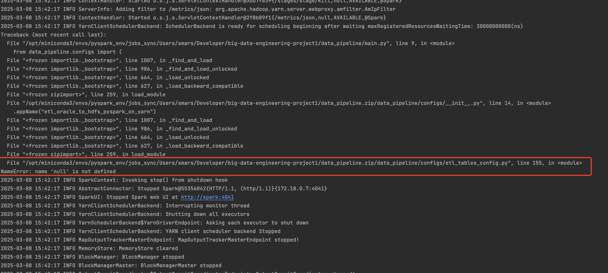

### Troubleshooting: JSON-like Dictionary Representation in Python Script Causes Execution Failure

#### **Issue Description**
While executing a Python script, an error occurred due to the improper use of a JSON-like structure inside a `.py` file. The JSON format was mistakenly used as a dictionary without proper syntax conversion, causing Python to fail in recognizing it as a valid dictionary object.

#### **Symptoms**
- Python throws a `NameError` or `SyntaxError` when trying to reference the incorrectly defined object.
- JSON-style dictionary is used in a `.py` file, causing execution failure.
- The script does not recognize `"null"` as a valid Python object, leading to errors.



#### **Root Cause**
The issue arises because **JSON format and Python dictionaries are similar but not identical**. JSON uses:
- **`null` instead of `None`** (Python uses `None`)
- **Double quotes (`"`) for keys** (Python allows both single and double quotes)
- **No support for trailing commas in JSON**, while Python allows them in certain cases.

For example, this incorrect JSON-style structure inside a Python script:
```python
etl_tables_config = {
    "name": "review",
    "type": ["null", "string"],
    "default": null,  # ❌ 'null' is not a valid Python keyword
    "doc": "The review text"
}
```
will cause **NameError: name 'null' is not defined** because `null` is not a recognized keyword in Python.

#### **Solution**
The JSON-like dictionary must be converted to a **valid Python dictionary** by:
1. **Replacing `null` with `None`**
2. **Ensuring proper key-value syntax**
3. **Making sure it follows Python's dictionary structure**

✅ **Corrected Python dictionary:**
```python
etl_tables_config = {
    "name": "review",
    "type": [None, "string"],  # ✅ 'null' replaced with 'None'
    "default": None,  # ✅ 'null' replaced with 'None'
    "doc": "The review text"
}
```

#### **Alternative Solutions**
If the data is originally in a JSON file and needs to be loaded into a Python script dynamically:
- Use `json.load()` to parse JSON correctly:
```python
import json

with open("oracle2hive_tables_config.py", "r") as f:
    etl_tables_config = json.load(f)
```
- If the JSON contains `null` values, Python will automatically convert them to `None`.

#### **Prevention Tips**
- Always use **Python dictionaries** instead of JSON format when writing `.py` files.
- Validate JSON files before loading them into Python.
- If working with external JSON data, use `json.load()` instead of hardcoding JSON-style structures in Python scripts.

#### **Conclusion**
This issue highlights the importance of differentiating **JSON syntax from Python dictionaries**. Proper conversions and best practices help prevent execution failures, ensuring smooth script execution and data processing.