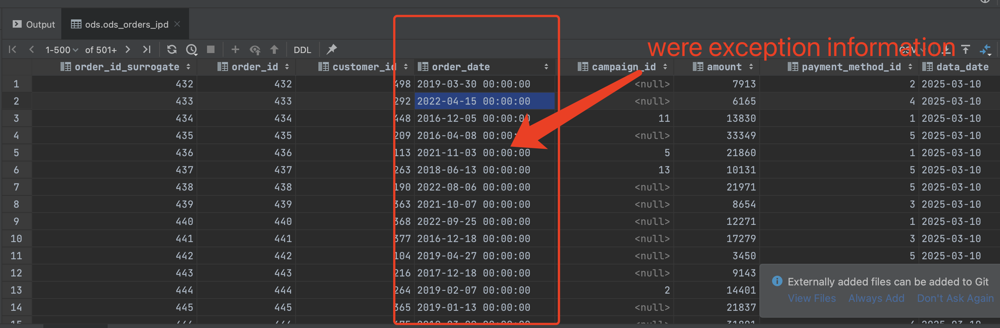
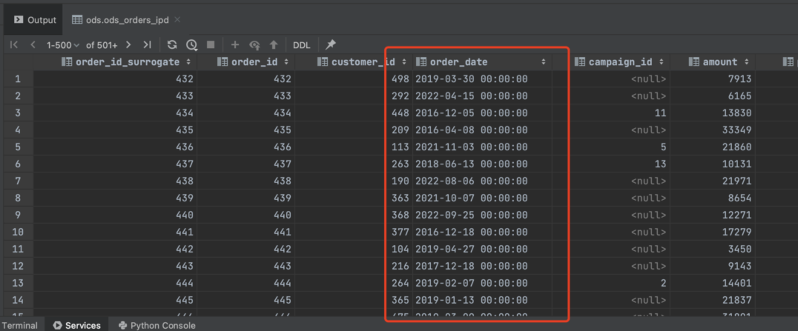

# Troubleshooting: Resolving "Unrecognized column type: DATE_TYPE" Issue on ods_orders_ipd Table

## Problem Description

When loading data into Hive using Spark with Avro format for the table `ods_orders_ipd`, the Avro schema defines date fields (e.g., `order_date`) as follows:

```json
{
  "name": "order_date",
  "type": {
    "type": "int",
    "logicalType": "date"
  },
  "doc": "The date generated on the order"
}
```

In Spark, the data is cast using `.cast(IntegerType())` (or previously `.cast(DateType())`), and the Avro files are written with the original Avro schema preserved. However, when querying the table in Hive via JDBC, 

All the values in the `order_date` field are the following error:

```
Unrecognized column type: DATE_TYPE
java.sql.SQLException: Unrecognized column type:DATE_TYPE
  at org.apache.hive.jdbc.HiveBaseResultSet.getColumnValue(HiveBaseResultSet.java:430)
  at org.apache.hive.jdbc.HiveBaseResultSet.getObject(HiveBaseResultSet.java:467)
  ...
```


## Root Cause Analysis

### Avro Specification for Date Fields

- **Avro `int + logicalType=date`:**  
  In the Avro specification, a field defined with `type: "int"` and `logicalType: "date"` is essentially an extension of an integer. It represents the number of days elapsed since January 1, 1970. This design allows storing dates as integers while carrying semantic information.

### Hive Behavior

- **Mapping Avro Date Fields to Hive:**  
  When the Hive table is created using the Avro schema (with the property `avro.avsc.url` specified) and stored as Avro, Hive maps the field defined as `int` with `logicalType: "date"` to the Hive data type `DATE`.  
- **Compatibility Issues:**  
  Many versions of Hive or the JDBC drivers do not fully support this logical type conversion. As a result, when Hive attempts to return data for this field, the JDBC layer encounters a column type labeled `DATE_TYPE` that it does not recognize, leading to the error.

### Spark Data Loading

- **Spark Casting Behavior:**  
  In the Spark job, the date field is cast using either `IntegerType()` or `DateType()`. However, even if Spark writes the data as an integer (or as a date), the Avro schema remains unchanged. Hive continues to interpret the field based on the Avro schema (i.e., as `DATE`), which conflicts with the underlying data type and the expectations of the JDBC driver.

## Final Resolution and Recommendation

To resolve the conflict and avoid the `Unrecognized column type: DATE_TYPE` error, the recommendation is to process all date fields as strings during the Spark load phase. This approach decouples the physical storage from the logical type defined in the Avro schema. The detailed steps are as follows:

1. **Modify Avro Schema for Date Fields:**  
   Update the Avro schema for all date fields (e.g., `order_date`) to be treated as strings rather than as `int` with `logicalType: "date"`.  
   _Example (conceptual):_  
   ```json
   {
     "name": "order_date",
     "type": "string",
     "doc": "The date generated on the order"
   }
   ```

2. **Alter Hive Table Definition:**  
   Change the Hive table DDL so that the `order_date` field is defined as `STRING` rather than `DATE`. This ensures that the field’s type in Hive is consistent with the underlying Avro data.  
   _Example:_  
   ```sql
   CREATE TABLE ods_orders_ipd (
       order_id STRING,
       order_date STRING,
       ...
   )
   STORED AS AVRO;
   ```

3. **Update Spark Casting Logic:**  
   In the Spark job, instead of casting the date field to `DateType()`, cast it to `StringType()`. This converts the integer representation (or date) into a string in the format `"yyyy-MM-dd"`.  
   _Example Spark Code:_  
   ```python
   from pyspark.sql.functions import expr, col

   # Convert integer date (days since 1970-01-01) to a formatted string
   df = df.withColumn("order_date", expr("date_add('1970-01-01', order_date)"))
   df = df.withColumn("order_date", col("order_date").cast("string"))
   ```

4. **Post-Processing in Downstream Layers:**  
   In the subsequent processing layers (e.g., during the transformation from ODS to DWD), convert the string representation back to the desired date type if necessary.

This solution ensures that the Avro schema remains unchanged for compatibility with existing systems, while Hive receives data in a format that does not trigger the `DATE_TYPE` error during JDBC queries.

## Conclusion

The root cause of the `Unrecognized column type: DATE_TYPE` error is the incompatibility between the Avro logical type definition for date (int with logicalType=date), Hive’s mapping of this field to `DATE` due to the use of an Avro schema, and the JDBC driver’s inability to recognize the resulting column type. By converting date fields to strings in Spark and aligning the Hive table’s definition to use `INT`, the issue can be resolved. Downstream data processing can then handle any necessary type conversion.

