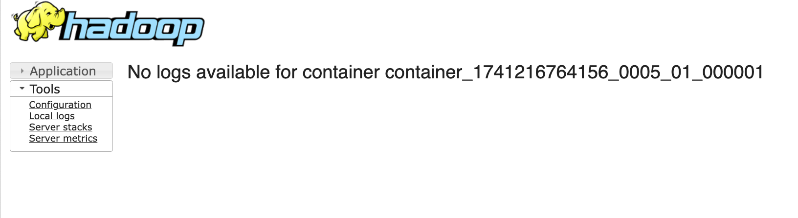

# Bugs Need To Be Fixed in Future

## 1. Future Bug Fix Record: Yarn Log Aggregation Inconsistency when Spark on Yarn by Cluster Mode

### Description

    

In the current Hadoop + Yarn setup, Spark jobs sometimes fail to display logs in the Yarn Web UI, even though the job succeeds. Specifically:

1. **Some completed applications** show "No logs available for container…" in the Yarn Web UI’s log link, but:

   - `yarn logs -applicationId ...` can successfully retrieve the logs, or
   - `hdfs dfs -cat /tmp/logs/root/logs-tfile/application_XXXX/...` can retrieve them as well.
2. **Other completed applications** show no logs in the Web UI **and** the logs do not exist at all in HDFS (`/tmp/logs/...`), nor in the local NM logs directory.

Overall, **it’s inconsistent**: some applications fully expose logs in the Web UI, some partially, and others not at all.

---

## Possible Causes

1. **Yarn Log Aggregation Timing/Failure**

   - Yarn’s log aggregation occurs only after the application finishes. If NodeManager local directories are cleaned too early or an error occurs, logs may not be uploaded to HDFS in time.
2. **Disk Space / NodeManager Health**

   - If a NodeManager sees disk usage above the configured threshold (default 90%), it might skip local log writing or fail to aggregate logs, causing them to never appear in HDFS.
3. **Misconfiguration in NodeManager or Yarn**

   - Different nodes could have inconsistent `yarn.log-aggregation-enable`, `yarn.nodemanager.remote-app-log-dir`, or permission settings, leading to partial log uploads.
4. **Spark vs. MapReduce Log Links**

   - Some Yarn Web UI links are more aligned with MapReduce tasks. Spark applications may not always produce logs that the JobHistory Server can parse correctly.
5. **Short-Lived Jobs**

   - Rapidly finishing jobs might not fully flush or store logs before NodeManager cleans them up, especially if relevant intervals or thresholds are configured sub-optimally.

---

### Current Situation & Impact

- **Impact**: It’s inconsistent to diagnose issues from Yarn’s Web UI. One must rely on `yarn logs -applicationId` or direct HDFS cat commands for guaranteed log retrieval.
- **Current Priority**: Low. Spark jobs do succeed, and logs can often be retrieved via CLI if needed. The Web UI inconsistency doesn’t block day-to-day operations but is annoying.

---

### Temporary Workarounds

1. **Use CLI**

   - Run `yarn logs -applicationId <ID>` to access the logs.
   - If logs were successfully aggregated, they will appear here even if the Web UI says "No logs available."
2. **Check HDFS Directly**

   - Inspect `/tmp/logs/<user>/logs-tfile/application_XXXX_YYYY` to see if the logs are present.
3. **Allow More Time for Aggregation**

   - Sometimes just waiting a few extra seconds/minutes after job completion helps the logs appear.
4. **Rely on Spark History Server**

   - For Spark internal logs and event data, enabling Spark EventLog and viewing them in Spark History Server can complement Yarn’s log references.

---

### Future Plans

When we revisit the Yarn log aggregation system:

- **Ensure All NodeManagers** share the same log aggregation configurations, have consistent disk usage thresholds, and have no permission conflicts.
- **Increase / Validate Disk Space** on each NodeManager to prevent logs from being skipped.
- **Investigate Short-Lived Jobs** to confirm if logs are properly aggregated.
- **Explore Yarn / Spark Versions** to see if upgrading addresses any known log aggregation bugs.

For now, the system remains usable. This bug is labeled as a "future fix" and will be examined in detail at a later stage.
