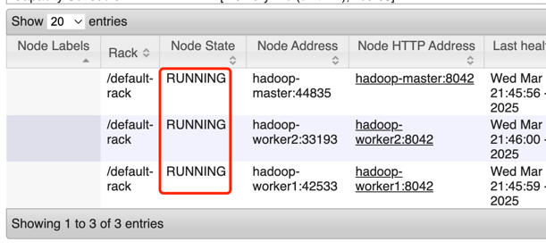

# Quick Start

Your Environment Requirements:

- Docker version 28.0.1 
- git version 2.39.5
- 

## Docker Memory and Disk Configuration

## Hadoop Cluster Launching

Pull Docker Images from my Docker Hub Repository
```bash
docker pull smarsbhu/proj1-dwh-cluster:hadoop-master-smars-1.0
docker pull smarsbhu/proj1-dwh-cluster:hadoop-worker1-smars-1.0
docker pull smarsbhu/proj1-dwh-cluster:hadoop-worker2-smars-1.0
docker pull smarsbhu/proj1-dwh-cluster:mysql-hive-metastore-smars-1.0
docker pull smarsbhu/proj1-dwh-cluster:hive-smars-1.0
docker pull smarsbhu/proj1-dwh-cluster:spark-smars-1.0
docker pull smarsbhu/proj1-dwh-cluster:oracle-oltp-smars-1.0
docker pull smarsbhu/proj1-dwh-cluster:airflow-smars-1.0
```

If you want to save the container as local images
```bash
docker commit hadoop-master smarsbhu/proj1-dwh-cluster:hadoop-master-latest
docker commit hadoop-worker1 smarsbhu/proj1-dwh-cluster:hadoop-worker1-latest
docker commit hadoop-worker2 smarsbhu/proj1-dwh-cluster:hadoop-worker2-latest
docker commit mysql-hive-metastore  smarsbhu/proj1-dwh-cluster:mysql-hive-metastore-latest
docker commit hive smarsbhu/proj1-dwh-cluster:hive-latest
docker commit spark smarsbhu/proj1-dwh-cluster:spark-latest
docker commit oracle-oltp smarsbhu/proj1-dwh-cluster:oracle-oltp-latest
docker commit airflow smarsbhu/proj1-dwh-cluster:airflow-latest
```

Git Clone my repo

```bash
git clone git@github.com:Smars-Bin-Hu/EComDWH-Pipeline.git <your/path>
```

Under the main folder `/ComDWH-Pipeline`

```bash
docker compose -f docker-compose-bigdata.yml up -d
```

> [!NOTE]
> Add the container hostname your host machine local hosts list for convenience. 
> For example, you could use `http://hadoop-master:8088/` for accessing Yarn Web UI, also you could use `http://localhost:8088/` on your host machine in most time, but some web internal link may still use container hostname instead of `127.0.0.1`, like access Spark Web UI via Yarn Web UI, the Yarn would not parse the hostname as `spark` instead of `localhost`.

To add the hosts list, for `MacOS` use:
```bash
nano /etc/hosts
```
As for Linux, Windows User, could check out this link to add the new hosts. https://www.liquidweb.com/blog/edit-hosts-file-macos-windows-linux/

add below hosts configuration
```bash
# for docker network
127.0.0.1   hadoop-master
127.0.0.1   hadoop-worker1
127.0.0.1   hadoop-worker2
127.0.0.1   mysql-hive-metastore
127.0.0.1   hive
127.0.0.1   spark
127.0.0.1   oracle-oltp
127.0.0.1   airflow
```

Login Container

Directly login the container by below docker command:
```bash
docker exec -it --user root hadoop-master bash
docker exec -it --user root hadoop-worker1 bash
docker exec -it --user root hadoop-worker2 bash
docker exec -it --user root mysql-hive-metastore bash
docker exec -it --user root hive bash
docker exec -it --user root spark bash
docker exec -it --user root airflow bash
docker exec -it --user root oracle-oltp bash
```

Also, I open the ssh port 22 for those containers: `hadoop-master`, `hadoop-worker1`, `hadoop-worker2`,`spark`, so you could use `ssh` command to log in those 4 containers as well. 

run below commands one by one

aiming at `hadoop-master`,`hadoop-worker1`,`hadoop-worker2`
```bash
# 1. All 3: `hadoop-master`,`hadoop-worker1`,`hadoop-worker2`
# if launched already, then ignore this
zkServer.sh start && hdfs --daemon start journalnode 

# 2. `hadoop-master` `hadoop-worker2` (2 NameNodes)
hdfs --daemon start namenode  && hdfs --daemon start zkfc

# 3. `hadoop-master`,`hadoop-worker1` (2 resourceManagers)
yarn --daemon start resourcemanager

# 4. All 3: `hadoop-master`,`hadoop-worker1`,`hadoop-worker2`
rm -rf /usr/local/opt/module/hadoop/data/data/* && hdfs --daemon start datanode && yarn --daemon start nodemanager

# 5. `hadoop-master` only
mr-jobhistory-daemon.sh start historyserver
```

if you want to stop the service 
```bash
# Stop
# 0. Master
mr-jobhistory-daemon.sh stop historyserver

# 1. All
stop-yarn.sh && stop-dfs.sh && hdfs --daemon stop journalnode && zkServer.sh stop
```

***if Hadoop-Cluster Successful Launching:***

hadoop-master
```bash
root@hadoop-master:/usr/local/opt/module/hadoop/data# jps
1680 Jps
148 QuorumPeerMain  --zookeeper
980 ResourceManager -- ResourceManager1
1398 NodeManager -- NM
711 NameNode   -- NameNode1
1609 JobHistoryServer -- JobHistoryServer
235 JournalNode --zookeeper JN
557 DFSZKFailoverController -- ZK FC
1278 DataNode -- DN
```
hadoop-worker1
```bash
root@hadoop-worker1:/data# jps
577 NodeManager  -- NM
321 ResourceManager -- ResourceManager2
88 QuorumPeerMain -- zookeeper
457 DataNode -- DN
761 Jps
186 JournalNode -- zookeeper JN
```

hadoop-worker2
```bash
root@hadoop-worker2:/usr/local/opt/module/hadoop/data# jps
737 DataNode -- DN
609 DFSZKFailoverController  -- ZK FC
163 JournalNode  --zookeeper JN
68 QuorumPeerMain -- zookeeper
857 NodeManager -- NM
1021 Jps
479 NameNode -- NameNode2
```

zookeeper status check `hdfs haadmin -getServiceState nn1` and `hdfs haadmin -getServiceState nn2`
```bash
root@hadoop-master:/# hdfs haadmin -getServiceState nn1
standby

root@hadoop-master:/# hdfs haadmin -getServiceState nn2
active
```

zookeeper status check`yarn rmadmin -getServiceState rm1` and `yarn rmadmin -getServiceState rm2`
```bash
root@hadoop-master:/# yarn rmadmin -getServiceState rm1
active

root@hadoop-master:/# yarn rmadmin -getServiceState rm2
standby
```

Access web UI to check if yarn NodeManagers and hdfs DataNode are registered to cluster

http://localhost:8088/cluster/nodes



http://localhost:9870/dfshealth.html#tab-datanode


## Hive `Metastore` && `Hiveserver2` Launching

login `Hive` Container
```bash
docker exec -it --user root mysql-hive-metastore bash
```

Launche hive metastore
```bash
/opt/hive/bin/hive --service metastore
```

Launche hive hiveserver2
```bash
/opt/hive/bin/hive --service hiveserver2
```

check the port `9083`,`10000`,`10002` is listening
```bash
netstat -nltp
```

## Spark `ThriftServer` Launching

run below command
```bash
$SPARK_HOME/sbin/start-thriftserver.sh \
    --master yarn \
    --conf spark.sql.hive.metastore.version=3.1.3 \
    --conf spark.sql.hive.metastore.jars=path \
    --conf spark.hadoop.hive.metastore.uris=thrift://hive:9083 \
    --conf spark.sql.warehouse.dir=hdfs://ns-ha/user/hive/warehouse
```

check the JPS `SparkSubmit` and port `10000` listening
```bash
(base) root@spark:/# netstat
tcp6       0      0 :::10000                :::*                    LISTEN      50/java

(base) root@spark:/# jps
50 SparkSubmit
```