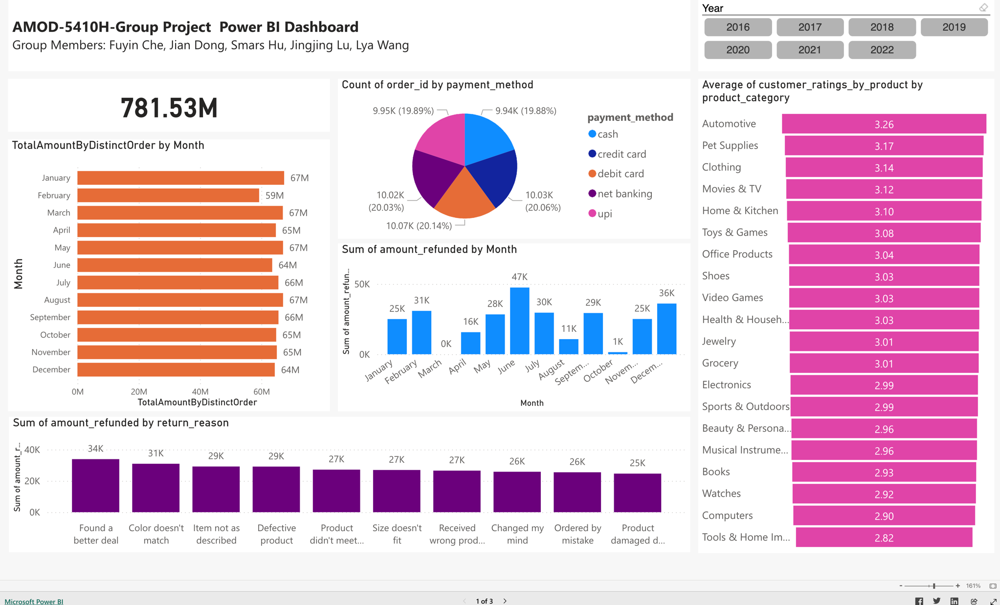

# 🚀 Source Code Quick Start

## Content

- System Requirements
- Launch containers and services
- Access the Data Warehouse
- OLAP Engine: Clickhouse
- Analytical BI Dashboard
- Test on a Windows Machine

## System Requirements

Your Environment Requirements:

- Operating System: MacOS 11 above, Windows 10, 11, Linux
- Docker v28.0.1 (to get the docker images)
- git (to get the source code to run the cluster)
- Bash (Windows User could use git bash instead, but not PowerShell)
- JetBrain IDEA or DataGrip or Navicat (or an IDE to connect the Spark ThriftServer)

In Docker Settings, you could config the memory, disk, number of cpu cores etc.

Recommend setting:
- CPU Limits: 10
- Memory limit: 16 GB
- Swap: 2 GB
- Disk usage limit: 240 GB

No IP and Ports Conficts in your host machine:
- Docker IP will use `172.18.0.*` as gateway and subnet
- Ports: some ports like `1521`(Oracle), `3306`(MySQL), `10000`(HiveServer2), `10001`(SparkThriftServer), `8088` or `8089`(Yarn Web UI - RM1/RM2), `9870`/`9871`(HDFS - NM1/NM2) etc, will be used.
- you could customize above on the `docker-compose.yml`

## Launch containers and services

### (Required) 1. Add hosts configuration to host machine

> [!NOTE]
> Add the container hostname your host machine local hosts list for convenience.
>
> For example, when the `hadoop-worker1` is active ResourceManager, when you access `localhost:8088`, it will automatically redirect to `hadoop-worker1:8089`, but you cannot recognize the hostname `hadoop-worker1`, so the web page cannot be accessed unless you config them in your hosts list on your host machine. 

To add the hosts list, for `MacOS`or `Linux` use:
```bash
nano /etc/hosts
```
As for Windows User, could check out this link to add the new hosts. https://www.liquidweb.com/blog/edit-hosts-file-macos-windows-linux/

```bash
# for docker network
127.0.0.1   hadoop-master
127.0.0.1   hadoop-worker1
127.0.0.1   hadoop-worker2
127.0.0.1   mysql-hive-metastore
127.0.0.1   hive
127.0.0.1   spark
127.0.0.1   oracle-oltp
127.0.0.1   airflow
```

### 2.Download the Docker Images

Pull Docker Images from my Docker Hub Repository: https://hub.docker.com/r/smarsbhu/proj1-dwh-cluster/tags
```bash
docker pull smarsbhu/proj1-dwh-cluster:hadoop-master-smars-1.1.2
docker pull smarsbhu/proj1-dwh-cluster:hadoop-worker1-smars-1.1.2
docker pull smarsbhu/proj1-dwh-cluster:hadoop-worker2-smars-1.1.2
docker pull smarsbhu/proj1-dwh-cluster:mysql-hive-metastore-smars-1.1.2
docker pull smarsbhu/proj1-dwh-cluster:hive-smars-1.1.2
docker pull smarsbhu/proj1-dwh-cluster:spark-smars-1.1.1
docker pull smarsbhu/proj1-dwh-cluster:oracle-oltp-smars-1.1.1
docker pull smarsbhu/proj1-dwh-cluster:airflow-smars-1.1.1
```

open your .env config (Important!)
> [!IMPORTANT]
> Must config and double check this `.env` file before docker compose launching

Under the main folder `/ComDWH-Pipeline`, check the `.env` file
```dotenv
# <<<<<<<<<<<<<<<<<<<<<<<<<<>>>>>>>>>>>>>>>>>>>>>>>>>>>>>>>>>>>>>>
# make .env public is for helping you deploy the testing hadoop cluster using docker-compose.yml
# <<<<<<<<<<<<<<<<<<<<< Start - Your Config >>>>>>>>>>>>>>>>>>>>>>>>>>>

# (Required) Replace ${HADOOP_DATA_LOCAL_MOUNT_PATH} by your local valid path, to mount the hadoop cluster data
HADOOP_DATA_LOCAL_MOUNT_PATH=/Users/smars/bigdata-cluster-volume/hadoop-master/data

# (Optional) You may replace image name if you changed the pulled images'name yourself
HADOOP_MASTER_IMAGE=smarsbhu/proj1-dwh-cluster:hadoop-master-smars-1.1.2
HADOOP_WORKER1_IMAGE=smarsbhu/proj1-dwh-cluster:hadoop-worker1-smars-1.1.2
HADOOP_WORKER2_IMAGE=smarsbhu/proj1-dwh-cluster:hadoop-worker2-smars-1.1.2
MYSQL_HIVE_METASTORE_IMAGE=smarsbhu/proj1-dwh-cluster:mysql-hive-metastore-smars-1.1.2
HIVE_IMAGE=smarsbhu/proj1-dwh-cluster:hive-smars-1.1.2
SPARK_IMAGE=smarsbhu/proj1-dwh-cluster:spark-smars-1.1.1
ORACLE_OLTP_IMAGE=smarsbhu/proj1-dwh-cluster:oracle-oltp-smars-1.1.1
AIRFLOW_IMAGE=smarsbhu/proj1-dwh-cluster:airflow-smars-1.1.1

# (Optional) Customize your localhost port config if you wish (you may want to change them to avoid port conflicts)
LOCALHOST_SSH_PORT_HADOOP_MASTER=2222
LOCALHOST_SSH_PORT_HADOOP_WORKER1=2223
LOCALHOST_SSH_PORT_HADOOP_WORKER2=2224
LOCALHOST_SSH_PORT_SPARK=2226
LOCALHOST_HDFS_PORT=8020
LOCALHOST_HDFS_NN1_WEB_UI=9870
LOCALHOST_HDFS_NN2_WEB_UI=9871
LOCALHOST_YARN_RM1_WEB_UI=8088
LOCALHOST_YARN_RM2_WEB_UI=8089
LOCALHOST_YARN_NM1_LOG_WEB_UI=8042
LOCALHOST_YARN_NM2_LOG_WEB_UI=8043
LOCALHOST_YARN_NM3_LOG_WEB_UI=8044
LOCALHOST_YARN_JOB_HISTORY_SERVER=19888
LOCALHOST_HIVE_SERVER2_PORT=10000
LOCALHOST_HIVE_SERVER2_2ND_PORT=10002
LOCALHOST_HIVE_METASTORE_PORT=9083
LOCALHOST_MYSQL=3306
LOCALHOST_ORACLE_CONNECT=1521
LOCALHOST_ORACLE_MANAGE_CONSOLE=5500
LOCALHOST_AIRFLOW_WEB_UI=8080
LOCALHOST_SPARK_WEB_UI=4040
LOCALHOST_SPARK_MASTER=7077
LOCALHOST_SPARK_THRIFT_SERVER_PORT=10001
# <<<<<<<<<<<<<<<<<<<<< End - Your Config >>>>>>>>>>>>>>>>>>>>>>>>>>>
```

Under the main folder `/ComDWH-Pipeline`, run the `docker-compose-bigdata.yml` file

```bash
docker compose -f docker-compose-bigdata.yml up -d
```

### 3. Log in containers

Login Container by directly logging in the container by below docker command:
```bash
docker exec -it --user root hadoop-master bash
docker exec -it --user root hadoop-worker1 bash
docker exec -it --user root hadoop-worker2 bash
docker exec -it --user root mysql-hive-metastore bash
docker exec -it --user root hive bash
docker exec -it --user root spark bash
docker exec -it --user root airflow bash
docker exec -it --user root oracle-oltp bash
```

### 4. Start the hadoop cluster services

run the script `start-hadoop-cluster.sh`
```bash
AMOD_5410_term_project % bash start-hadoop-cluster.sh
```

**(Optional) Check if successful launched already** 

container `hadoop-master`
```bash
root@hadoop-master:/# jps
1680 Jps
148 QuorumPeerMain  --zookeeper
980 ResourceManager -- ResourceManager1
1398 NodeManager -- NM
711 NameNode   -- NameNode1
1609 JobHistoryServer -- JobHistoryServer
235 JournalNode --zookeeper JN
557 DFSZKFailoverController -- ZK FC
1278 DataNode -- DN
```

container `hadoop-worker1`
```bash
root@hadoop-worker1:/# jps
577 NodeManager  -- NM
321 ResourceManager -- ResourceManager2
88 QuorumPeerMain -- zookeeper
457 DataNode -- DN
761 Jps
186 JournalNode -- zookeeper JN
```

container `hadoop-worker2`
```bash
root@hadoop-worker2:/# jps
737 DataNode -- DN
609 DFSZKFailoverController  -- ZK FC
163 JournalNode  --zookeeper JN
68 QuorumPeerMain -- zookeeper
857 NodeManager -- NM
1021 Jps
479 NameNode -- NameNode2
```

zookeeper status check `hdfs haadmin -getServiceState nn1` and `hdfs haadmin -getServiceState nn2`
```bash
root@hadoop-master:/# hdfs haadmin -getServiceState nn1
standby

root@hadoop-master:/# hdfs haadmin -getServiceState nn2
active
```

zookeeper status check`yarn rmadmin -getServiceState rm1` and `yarn rmadmin -getServiceState rm2`
```bash
root@hadoop-master:/# yarn rmadmin -getServiceState rm1
active

root@hadoop-master:/# yarn rmadmin -getServiceState rm2
standby
```

Access web UI to check if yarn NodeManagers and hdfs DataNode are registered to cluster

http://localhost:8088/cluster/nodes


http://localhost:9870/dfshealth.html#tab-datanode


> [!TIP]                               
> Overall, if you get the results the same as above pictures, that means your cluster is already launched successfully.

***(Optional) Stop the hadoop cluster services***

if you want to **STOP** the hadoop cluster services, run the script `stop-hadoop-cluster.sh`
```bash
AMOD_5410_term_project % bash stop-hadoop-cluster.sh
```

### 5. MySQL metastore restoring

the first time you launch my docker container, you have to use `mysql-metadata-restore.sh` to restore the dumped `.sql` file, otherwise you cannot access the data on HDFS by Hive.
```bash
AMOD_5410_term_project % bash mysql-metadata-restore.sh
```

### 6. Launch The Data Clients (Hive, Spark)

run the script: `start-data-clients.sh` to start Hive `Metastore` && `Hiveserver2` and Spark `ThriftServer`
```bash
AMOD_5410_term_project % bash start-data-clients.sh
```

> [!IMPORTANT]
> Make sure the Hadoop Cluster HDFS Safe Mode is off before running `hiveserver2`

log in the `hive` container, check the port `9083`,`10000`,`10002` is listening **after a few seconds**
```bash
docker exec -it --user root hive bash
```
run this command to check the ports
```bash
root@hive:/# netstat -nltp
```


log in the `spark` container, check the port `10000` is listening **after a few seconds**
```bash
docker exec -it --user root spark bash
```
run this command to check the ports
```bash
root@spark:/# netstat -nltp
```


## Access the Data Warehouse

use an IDE to connect the Spark ThriftServer (No Password Required)

Driver is Apache Spark


URL is below
```bash
jdbc:hive2://spark:10001
```


use Spark ThriftServer to connect the Data Warehouse, and then you could access the data warehouse.


run some Spark SQL

```sql
-- operational data storage
select * from ods.ods_product_fpd;

-- data warehouse details
select * from dwd.dwd_customer_product_ratings_ipd where data_date='' limit 20;

-- data warehouse middle
select * from dwm.dwm_orders_with_items_ipd where data_date='' limit 20;

-- data warehouse summary 
select * from dws.dws_orders_detailed_info_wide_ipd where data_date='' limit 20;

-- dimensional layer
select * from dim.dim_payment_method_fpd limit 20;
```
some output screenshots:


## OLAP Engine: Clickhouse 

I used my Azure Clickhouse as the ADS (Analytical Data Store).

The data was loaded from data warehouse, using the data in the `dws` layer by PySpark.

Here is its screenshots. This is an ultra wide fact table joined with all the dimensional tables, for BI analytical use.


## Analytical BI Dashboard

We use the Cloud PowerBI to connect the Clickhouse and show the dashboard.

The BI will be refreshed automatically in terms of the update of clickhouse.

Here is its link: [Cloud Power BI dashboard](https://app.powerbi.com/view?r=eyJrIjoiMzVjYTQ3NmMtODllZS00N2JhLWFkNWItMWI4MmYyNDZjMDc1IiwidCI6IjI0MGI3OWM1LTZiZWYtNDYwOC1hNDE3LTY1NjllODQzNTQ1YyJ9)



## Test on a Windows Machine
We launched a test on a Windows version Docker Desktop(4.39.0). The original images are based on Mac OS (ARM), the performance of containers on Win11 platform may be slight different with Mac OS. The test results are shown as following:

- Launch Container

- Launch Hadoop cluster through scripts

- Status of Hadoop cluster
Hadoop master

Hadoop worker1

Hadoop worker2


- Check Zookeeper status

- Check cluster nodes and data nodes
overview

data nodes

cluster nodes

- Restore metadata in mysql

- Check Hive status

- Start Spark Service

- Connect to Spark through DataGrip

- Run Spark scripts


